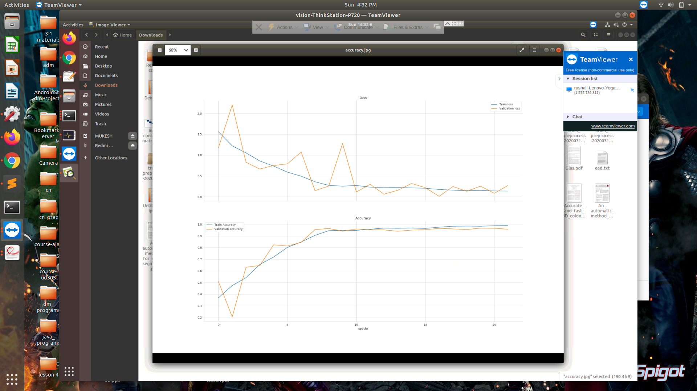
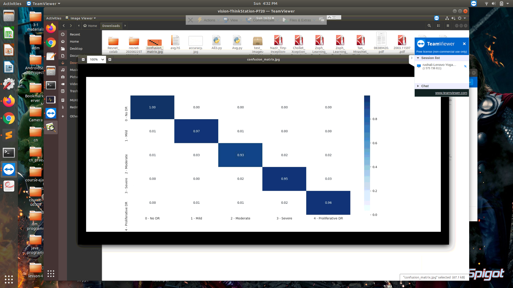

# Diabetic-Retinopathy-detection
A CNN ensembling based approach to grade severity of DR from fundus photographs

We're a group of B.Tech final year students from NIT Warangal, India. Our final year thesis project aims to automate the process
of detecting the stage of DR severity from fundus photographs after applying suitable preprocessing techniques.

We've developed an ensemble of pre trained models - InceptionNetV3 and DenseNet169. This hybrid model has shown the following results 
on the Kaggle 2019 DR dataset (after augmentation) -

Thus the model shows promising scope for real time deployment. We're currently working on techniques to reduce the size of the model
We have also proposed features extraction techniques using digital image processing.

# Dataset

Kaggle APTOS 2019 https://www.kaggle.com/c/aptos2019-blindness-detection/data

We've used further used augmentation techniques to create a balanced dataset having ~1000 images per class.A

# Files
1) Avg_final.py - A Keras file with code for training and testing the performance of ensemble model.

To run  - python Avg_final.py

Our saved ensemble model - https://drive.google.com/open?id=1Iqgw574Og4gzhZ5ZjdTP3IuHly26OqV6

DenseNet initial weights - https://drive.google.com/open?id=1vTEaFrKAcaW1t7bRJD9d98QWBoIgve-6

2) Augmentation.ipynb - Contains preprocessing and augmentation code for fundus images

3) Blood vessels morpho.ipynb - Contains code for traditional feature extraction for blood vessels

4) micro morpho.ipynb - Contains code for traditional feature extraction for microaneurysms

5) exudates.ipynb - Contains code for traditional feature extraction for exudates
